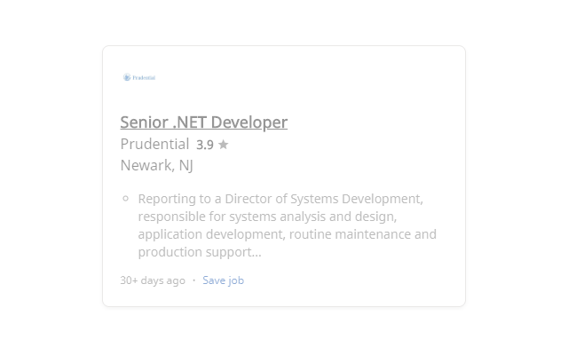

# Indoubt

Apply to jobs on indeed faster by quickly knowing which ones are old or from companies you wish to avoid.

## Description
A chrome extension that styles Indeed job posts based on age or whether it is in a list companies you do not want to apply to. This allows users to identify the jobs worth applying to to quicker by providing simple visual cues.

## Screenshots

